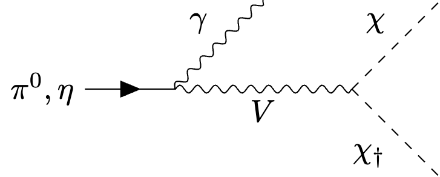

# Slidev Theme Frankfurt

Presentation slides for developers

  
    Press Space for next page <carbon:arrow-right class="inline"/>
  

---
section: Introduction
---

# What is Slidev?

Slidev is a slides maker and presenter designed for developers, consist of the following features

- 📝 **Text-based** - focus on the content with Markdown, and then style them later
- 🎨 **Themable** - theme can be shared and used with npm packages
- 🧑‍💻 **Developer Friendly** - code highlighting, live coding with autocompletion
- 🤹 **Interactive** - embedding Vue components to enhance your expressions
- 🎥 **Recording** - built-in recording and camera view
- 📤 **Portable** - export into PDF, PNGs, or even a hostable SPA
- 🛠 **Hackable** - anything possible on a webpage

 
 

Read more about [Why Slidev?](https://sli.dev/guide/why)

---

# Navigation

<Item title="Title of your thing">
	Create a box for definitions, lemmas, theorems, etc.
</Item>

---

# Code

<Item title="Neutral meson decay">
  

    
  

</Item>

---
section: Final words
layout: center
class: "text-center"
---

# Learn More

[Documentations](https://sli.dev) / [GitHub Repo](https://github.com/slidevjs/slidev)