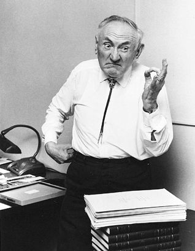
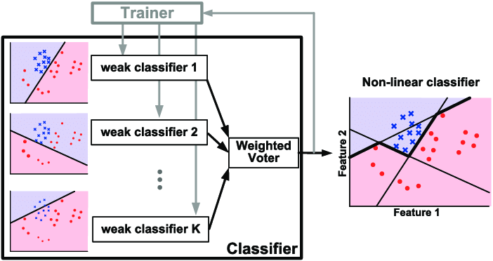
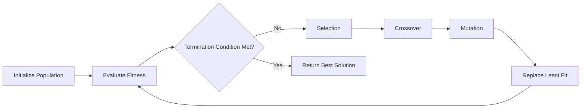
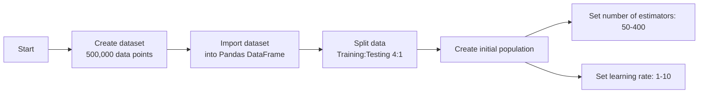
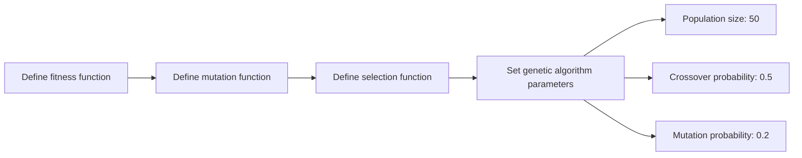
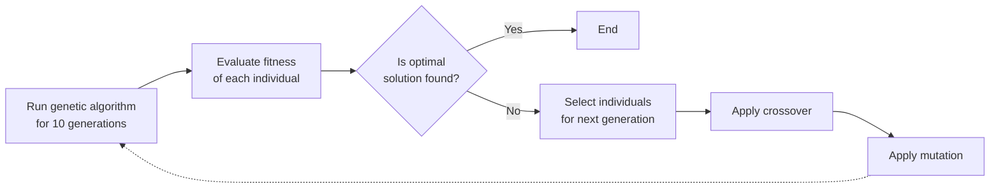

# Searching for Dark Photon Production Using Genetic Algorithms


<div>
Rohan Arni
</div>
High Technology High School, Lincroft NJ 07738, USA<br>
roarni@ctemc.org

---
section: Introduction
---

# Introduction to Dark Matter

<div className="grid grid-cols-2 grid-rows-2 gap-4">
  <div className="p-4">
    <ul className="list-disc list-inside">
      <li>Fritz Zwicky's hypothesis, 90 years ago</li>
      <li>Composition of universe: 27% dark matter, 85% of matter density</li>
      <li>Standard Model <b> does not account for</b> Dark Matter</li>
    </ul>
  </div>
  <div className="flex items-center justify-center p-4">
    
  </div>
  <div className="flex items-center justify-center p-4">
    
  </div>
  <div className="flex items-center justify-center p-4">
    
  </div>
</div>  


---

# The Dark Photon

- A force carrier for the dark sector, similar to the photon
- The dark photon could carry some "dark force"
- New force can be introduced to the standard model by extending the gauge group with a new $U(1)$ gauge symmetry
- The dark photon is massless if the gauge symmetry remains unbroken.

---

# The Dark Photon, cont'd

This U(1) gauge symmetry is associated with a new dark photon field, denoted as $A'_{\mu}$. The Lagrangian that includes kinetic mixing between the photon and the dark photon is given by:

<Item title="Kinetic Mixing Lagrangian"> 

$$\mathcal{L}=-\frac{1}{4}F_{\mu \nu}F^{\mu \nu} -\frac{1}{4}F'_{\mu \nu}F'^{\mu \nu} + \frac{\epsilon}{2}F_{\mu \nu}F'^{\mu \nu}+\frac{1}{2}m^2_{A'}A'_\mu A'^\mu$$


</Item>

Where:
- $F_{\mu \nu} = \partial_\mu A_\nu-\partial_\nu A_\mu$ is the electromagnetic field strength tensor, where $A_\mu$ is the SM photon field.
- $F'_{\mu \nu} = \partial_\mu A'_\nu-\partial_\nu A'_\mu$ is the dark photon field strength tensor, where $A'_\mu$ is the dark photon field.
- $\epsilon$ is the dimensionless kinetic mixing parameter.


---

# Diagonalizing Kinetic Terms

- Need to remove the mixing term so the kinetic terms only consist of parameters from one field.  
- Product $F_{\mu \nu}F'^{\mu \nu}$ should vanish. 
- We can do this with a field redefinition ($\tilde{A}_\mu$ and $\tilde{A'}_\mu$).  
- Redefinition must ensure the mixing term is eliminated, the fields are normalized, and that $\tilde{A'}_\mu$ is orthagonal to $\tilde{A}_\mu$.


<Item title = "Field Redefinition">

$$\tilde{A}_\mu=A_\mu+\epsilon A'_\mu$$
$$\tilde{A'}_\mu=\sqrt{1-\epsilon^2}A'_\mu$$

$$\mathcal{L}=-\frac{1}{4}\tilde{F}_{\mu \nu}\tilde{F}^{\mu \nu} -\frac{1}{4}\tilde{F}'_{\mu \nu}\tilde{F}'^{\mu \nu} $$


</Item>

---

# Interaction

<Item title="Interaction Between Photon and Charged Particle">

$$\mathcal{L}_\text{int}=eA_\mu J^\mu _{\text{em}}$$

</Item>

Where $e$ is the coupling constant (the charge of the particle) and $J^\mu _{\text{em}}$ is the electromagnetic current. Using our new definition of $\tilde{A}_\mu$, we can substitute:

<Item title ="Substitution">

$$\mathcal{L}_\text{int}=e\tilde{A}_\mu J^\mu _{\text{em}}$$
$$\mathcal{L}_\text{int}=e (A_\mu + \epsilon A'_\mu) J^\mu _{\text{em}}$$
$$\mathcal{L}_\text{int}=eA_\mu J^\mu _{\text{em}} + e\epsilon A'_\mu J^\mu _{\text{em}}$$
</Item>

---

# Consequences

- Based on the equation, the dark photon can interact with the same particles as a photon (suppressed by a factor $\epsilon$)

- This coupling opens up new interaction channels, such as the potential production of dark photons in processes involving electromagnetic interactions. For instance, in meson decays, a neutral pion $\pi^0$ can decay into a photon and a dark photon:

<Item title = "Production of Dark Photon">

$$\pi^0 \rightarrow \gamma + \tilde{A}'_\mu$$
</Item>

- The rate of such a process is proportional to $\epsilon^2$. The massless dark photon would contribute to missing energy signatures in experiments.

- The upper limit of $\epsilon^2$ was calculated to be around $10^{-6}$. 

--- 

# Machine Learning Approach


- The goal is to design an algorithm that can search for dark photons via missing/abnormal energy signatures. 
- A binary classification model can be used to evaluate a data point if a dark photon is produced or not. 
- Due to the nature of dark photon production, the resulting dataset will be imbalanced, with a majority of interaction not producing a dark photon.
- This imbalance can be accounted for with an AdaBoost model. 

<Item title="AdaBoost Diagram">
  <div className="flex justify-center items-center">
  
  </div>
</Item>


---

# Why Genetic Algorithms?

- The AdaBoost model has a set of hyperparameters (the number of estimators and the learning rate).
- Tuning the hyperparameters manually can take a lot of time to approach an optimal solution.
- A solution to this problem is by applying a genetic algorithm.


<Item title="Genetic Algorithm Flowchart">

</Item>

---
section: Methods
---

# Simulation

- Simulated proton-proton collisions at 14 TeV using ```Pythia3.8```
- The simulation was modified to add a decay channel $(\pi^0 \rightarrow \gamma + \tilde{A}'_\mu)$ with a branching ratio of $10^{-6}$
- The dark photon was defined as a stable massless particle that is color neutral, chargeless, and has a spin of 1
- To gather data from the simulation, the program calculated:
  - the scalar sum of jet transverse momenta $(HT)$ by summing the total visible energy
  - the missing transverse energy $(MET)$ by summing total energy produced by neutrinos and dark photons
  - the razor variable of mass scale $(MR)$
  - the razor variable $(R^2)$, which quantifies the balance of energy and momentum. 

---

# Data Calculations


- The razor variable of mass scale $(MR)$ was calculated via:


$$MR = \sqrt{(E_{1} + E_{2})^2 - (p^z_{1} + p^z_{2})^2}$$
  - where $E_{1}$ and $E_{2}$ are the energies of the two leading jets and $p^z_{1}$ and $p^z_{2}$ are their momenta along the beam axis (z-axis)

- The razor variable $(R^2)$, which quantifies the balance of energy and momentum was calculated via:


$$R^2 = \left(\frac{M_T}{MR}\right)^2$$
  - with $MT$ being defined as 
  $$M_T = \sqrt{2 |\vec{p}_T^{vis}| |\vec{MET}| (1 - \cos(\Delta\phi))}$$
  - and $\Delta\phi$ being the azimuthal angle between the visible system's momentum and the MET vector. 


---

# Algorithm, Pt. 1


<div style="display: flex; align-items: center; justify-content: center; min-height: 50vh;">
<div className="w-full p-4">
<Item title = "Initialization">


</Item>
</div>
</div>

---

# Algorithm, Pt. 2

<div style="display: flex; align-items: center; justify-content: center; min-height: 50vh;">
<div className="w-full p-4">
<Item title = "Genetic Algorithm Creation">


</Item>
</div>
</div>


---

# Algorithm, Pt. 3

<div style="display: flex; align-items: center; justify-content: center; min-height: 50vh;">
<div className="w-full p-4">
<Item title = "GA Execution">


</Item>
</div>
</div>


