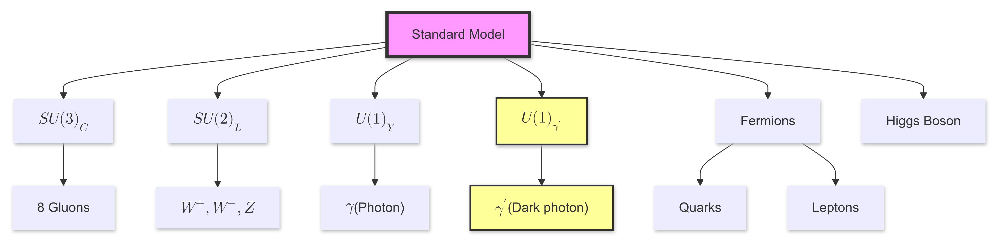
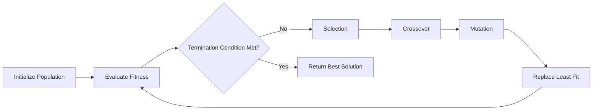
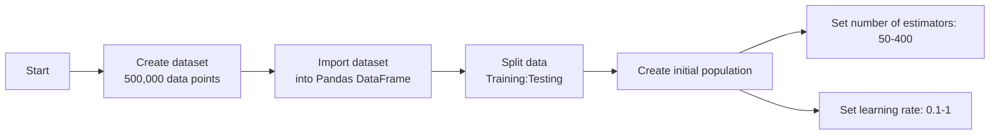
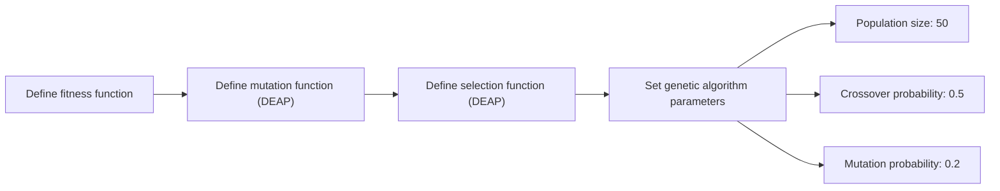
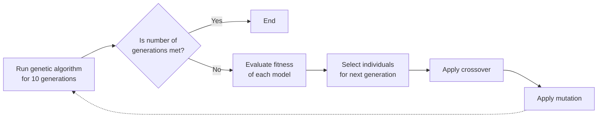

# Searching for Dark Photon Production Using Genetic Algorithms

<div>
Rohan Arni
</div>
High Technology High School, Lincroft NJ 07738, USA<br>
roarni@ctemc.org

---
section: Introduction
---

# The Dark Photon

- Dark matter makes up 27% of the energy density and 85% of the matter density of the universe.


- The Standard Model does not account for dark matter, a separate dark sector is proposed


- The dark photon is a force carrier for the dark sector, similar to the photon, interacts via kinetic mixing


- New particle can be introduced to the standard model by extending SM gauge group with new $U(1)$ gauge symmetry


<Item title="Extended Standard Model">
  <div className="flex justify-center items-center">
  
  </div>
</Item>

---

# The Dark Photon, cont'd


<Item title="Kinetic Mixing/Interaction Lagrangian"> 

$$\mathcal{L}_0=-\frac{1}{4}F_{\mu \nu}F^{\mu \nu} -\frac{1}{4}F'_{\mu \nu}F'^{\mu \nu} + \frac{\epsilon}{2}F_{\mu \nu}F'^{\mu \nu}$$
$$\mathcal{L}_{int} = e J_\mu A^{\mu} + e' J'_\mu A'^{\mu}$$

</Item>


Where:

- $F_{\mu \nu} = \partial_\mu A_\nu-\partial_\nu A_\mu$ is the electromagnetic field strength tensor, where $A_\mu$ is the SM photon field.


- $F'_{\mu \nu} = \partial_\mu A'_\nu-\partial_\nu A'_\mu$ is the dark photon field strength tensor, where $A'_\mu$ is the dark photon field.


- $\epsilon$ is the dimensionless kinetic mixing parameter.


---

# Diagonalizing Kinetic Terms


- Need to remove the mixing term so the kinetic terms only consist of parameters from one field.


<Item title = "Rotating Fields">

$$\begin{pmatrix}
A^\mu_a \\
A^\mu_b
\end{pmatrix}
=
\begin{pmatrix}
\frac{1}{\sqrt{1 - \epsilon^2}} & 0 \\
-\frac{\epsilon}{\sqrt{1 - \epsilon^2}} & 1
\end{pmatrix}
\begin{pmatrix}
\cos\theta & -\sin\theta \\
\sin\theta & \cos\theta
\end{pmatrix}
\begin{pmatrix}
A'^\mu \\
A^\mu
\end{pmatrix},
$$

</Item>


- After this rotation, if the dark photon has mass, we end up with the Lagrangian containing this term:


<Item title = "Charge Interaction">

$$\mathcal{L} \supset -\frac{e \epsilon}{\sqrt{1 - \epsilon^2}} J_\mu A'^\mu \simeq -e \epsilon J_\mu A'^\mu,$$


</Item>


---

# Consequences


- Based on the equation, the dark photon can interact with the same particles as a photon (suppressed by a factor $\epsilon$)


- This interaction is called the dark photon portal


- This portal opens up new interaction/production channels.


- For instance, in meson decays, a neutral pion $\pi^0$ can decay into a photon and a dark photon:


<Item title = "Production of Dark Photon">

$$\pi^0 \rightarrow \gamma + \gamma'$$
</Item>


- The rate of such a process is proportional to $\epsilon^2$ $(\approx 10^{-6})$. 


- The dark photon would contribute to missing energy signatures in experiments.


--- 

# Machine Learning Approach


- The goal is to design an algorithm that can search for dark photons via missing/abnormal energy signatures.


- A binary classification model can be used to evaluate a data point if a dark photon is produced or not.


- Due to the nature of dark photon production, the resulting dataset will be imbalanced, with a majority of interaction not producing a dark photon.


- This imbalance can be accounted for with an AdaBoost model.


<Item title="AdaBoost Diagram">
  <div className="flex justify-center items-center">
  
  </div>
</Item>

---

# Why Genetic Algorithms?


- The AdaBoost model has a set of hyperparameters (the number of estimators and the learning rate).

- Tuning the hyperparameters manually can take a lot of time to approach an optimal solution.


- An optimal solution to this problem can be reached with a genetic algorithm.


<Item title="Genetic Algorithm Flowchart">

</Item>

---
section: Methods
---

# Data Simulation


- Simulated proton-proton collisions at 14 TeV using ```Pythia3.8``` on a 2021 MacBook Pro (M1 Pro, 32 GB RAM)


- The simulation was modified to add a decay channel $(\pi^0 \rightarrow \gamma + \gamma')$ with a branching ratio of $10^{-6}$

- The dark photon was defined as a stable particle that is color neutral, chargeless, has a spin of 1 and a mass of $10^{-20}$ eV


- To gather data from the simulation, the program calculated:
  - the scalar sum of jet transverse momenta $(HT)$ by summing the total visible energy
  - the missing transverse energy $(MET)$ by summing total energy produced by neutrinos and dark photons
  - the razor variable of mass scale $(MR)$
  - the razor variable $(R^2)$, which quantifies the balance of energy and momentum. 
  - boolean flag that checked if a dark photon was produced.


---

# Data Calculations

More in-depth calculations:
<Item title="MR Formula">

$$MR = \sqrt{(E_{1} + E_{2})^2 - (p^z_{1} + p^z_{2})^2}$$
</Item>

<Item title="R2 Formula">

$$R^2 = \left(\frac{M_T}{MR}\right)^2$$
$$M_T = \sqrt{2 |\vec{p}_T^{vis}| |\vec{MET}| (1 - \cos(\Delta\phi))}$$

</Item>

---

# Algorithm, Pt. 1

<div style="display: flex; align-items: center; justify-content: center; min-height: 50vh;">
<div className="w-full p-4">
<Item title = "Initialization">


</Item>
</div>
</div>

---

# Algorithm, Pt. 2

<div style="display: flex; align-items: center; justify-content: center; min-height: 50vh;">
<div className="w-full p-4">
<Item title = "Genetic Algorithm Creation">


</Item>
</div>
</div>

---

# Algorithm, Pt. 3

<div style="display: flex; align-items: center; justify-content: center; min-height: 50vh;">
<div className="w-full p-4">
<Item title = "GA Execution">


</Item>
</div>
</div>

---
section: Results
---

# Data Snapshot


- In the data set, only 25 out of 500,000 data points indicated that a dark photon was produced.


<Item title = "Snapshot of Simulation Data">

| Event Number | $HT$ | $MET$ | $MR$ | $R^2$ | Dark Photon Produced? |
|--------------|-----|-----|-----|-----|----------|
| 352806 | 94.775 | 0.000 | 14000.000 | 0.000000 | False |
| 417824 | 48.964 | 0.000 | 14000.000 | 0.000000 | False |
| 469847 | 196.721 | 0.000 | 14000.000 | 0.000000 | False |
| 407746 | 118.227 | 1.069 | 13983.157 | 2.585e-06 | False |
| 469848 | 105.605 | 0.000 | 14000.000 | 0.000000 | False |
</Item>

---

# Genetic Algorithm Output Data

<Item title = "Genetic Algorithm Data">

| Generation | Num. Evals | Avg. Fitness | Std. Dev Of Fitness | Min Fitness | Max Fitness |
|-----|-----------|--------------|---------------------|-------------|-------------|
| 1   | 33        | 0.999929     | 1.91844e-05         | 0.99988     | 0.99995     |
| 3   | 27        | 0.999949     | 6.00333e-06         | 0.99992     | 0.99995     |
| 5   | 28        | 0.99995      | 1.11022e-16         | 0.99995     | 0.99995     |
| 7   | 34        | 0.999949     | 4.58258e-06         | 0.99992     | 0.99995     |
| 9   | 28        | 0.999949     | 4.58258e-06         | 0.99992     | 0.99995     |
| 10  | 40        | 0.99995      | 1.4e-06             | 0.99994     | 0.99995     |
</Item>

---

# Final Model Results


- After algorithm execution, the algorithm converged on a solution with a fitness of 0.99995. 


- The hyperparameters of the model are:


<Item title="Final Model Hyperparameters">

| Number of Estimators | Learning Rate |
|----------------------|---------------|
| 319 | 0.1 |

</Item>


- Evaluating the model on the testing dataset resulted in an accuracy of 99.995%. 


- However, the accuracy for instances where a dark photon was produced stood at 80%.


- Model had no false positives. 


---
section: Conclusions
---

# Conclusions


- The GA was successful in finding a model with a high accuracy, as shown by a model accuracy of 99.995% on the testing dataset.


- However, the accuracy for instances where a dark photon was produced stood at 80%.

- This dataset had an extreme imbalance, explaining the 80% accuracy on data points where a dark photon was produced in the testing set.


- This can be countered with using more advanced classification techniques (RL, XGBoost, etc.)


- However, there were no false positives, meaning that this algorithm could be used in beam experiments to find data to support the idea that dark photons are produced in these proton-proton experiments.


---

# Summary: Dark Photon Search Using Genetic Algorithms

- Dark photon: Proposed force carrier for dark matter, interacts with SM photon via kinetic mixing
- Simulation: Proton-proton collisions at 14 TeV, added decay channel ($\pi^0 \rightarrow \gamma + \gamma'$)
- ML approach: AdaBoost model for binary classification, genetic algorithm for hyperparameter tuning
  - Hyperparameters optimized: number of estimators, learning rate

- Dataset: 500,000 points, only 25 with dark photon production (extreme imbalance)

- Results: 
  - Overall accuracy: 99.995%
  - Accuracy for dark photon events: 80%, no false positives

- Conclusion: Promising for beam experiments, but advanced techniques needed to address imbalance
  - Potential improvements: Reinforcement Learning, XGBoost

--- 
section: Acknowledgements
---

# Acknowledgements

<div style="display: flex; align-items: center; justify-content: center; min-height: 50vh;">
<div className="w-full p-4">
<Item title = "Acknowledgements">
I would like to thank:

- Dr. Richard Oppenheim and Dr. Bruce Cortez (ex-AT&T Research) for their feedback and guidance for this project. 
- The University of Chicago and the organizers of the TeVPA conference for giving me an opportunity to share my research.

</Item>
</div>
</div>

---
section: Questions
layout: center
class: "text-center"
---

# Questions?

---
section: Citations
---

# Citations

<div style="font-size: 11px;">
    <ul>
        <li>Aguilar-Arevalo, A.A.: Search for Dark Matter in the Beam-Dump of a Proton Beam with MiniBooNE. Journal of Physics: Conference Series <strong>912</strong>, 012017 (2017). <a href="https://doi.org/10.1088/1742-6596/912/1/012017">https://doi.org/10.1088/1742-6596/912/1/012017</a></li>
        <li>Batley, J., et al.: Search for the dark photon in decays. Physics Letters B <strong>746</strong>, 178–185 (2015). <a href="https://doi.org/10.1016/j.physletb.2015.04.068">https://doi.org/10.1016/j.physletb.2015.04.068</a></li>
        <li>Battaglieri, M., et al.: Dark Matter Search in a Beam-Dump EXperiment (BDX) at Jefferson Lab an Update on PR12-16-001 the BDX Collaboration. (2018).</li>
        <li>Berkane, A., Boussahel, M.: Dark Photon as an Extra U(1) Extension to the Standard Model with General Rotation in Kinetic Mixing. (2021).</li>
        <li>Celentano, A., et al.: New Production Channels for Light Dark Matter in Hadronic Showers. Physical Review D <strong>102</strong>(7), 075026 (2020). <a href="https://doi.org/10.1103/physrevd.102.075026">https://doi.org/10.1103/physrevd.102.075026</a></li>
        <li>Chatrchyan, S., et al.: Search for Supersymmetry with Razor Variables In PP Collisions Ats=7 TeV. Physical Review D <strong>90</strong>(11), 112001 (2014). <a href="https://doi.org/10.1103/physrevd.90.112001">https://doi.org/10.1103/physrevd.90.112001</a></li>
        <li>Cushman, P., et al.: Snowmass CF1 Summary: WIMP Dark Matter Direct Detection. (2013). <a href="https://doi.org/10.48550/arxiv.1310.8327">https://doi.org/10.48550/arxiv.1310.8327</a></li>
        <li>De Napoli, M.: Production and Detection of Light Dark Matter at Jefferson Lab: The BDX Experiment. Universe <strong>5</strong>(5), 120 (2019). <a href="https://doi.org/10.3390/universe5050120">https://doi.org/10.3390/universe5050120</a></li>
        <li>Deb, K.: Genetic Algorithm in Search and Optimization: The Technique and Applications. (1998). <a href="http://repository.ias.ac.in/82743/">http://repository.ias.ac.in/82743/</a></li>
        <li>Dutra, M., et al.: MeV Dark Matter Complementarity and the Dark Photon Portal. Journal of Cosmology and Astroparticle Physics <strong>2018</strong>(03), 037–037 (2018). <a href="https://doi.org/10.1088/1475-7516/2018/03/037">https://doi.org/10.1088/1475-7516/2018/03/037</a></li>
        <li>Fabbrichesi, M., et al.: The Dark Photon. (2020).</li>
        <li>Leung, Y., et al.: Degree of Population Diversity - a Perspective on Premature Convergence in Genetic Algorithms and Its Markov Chain Analysis. IEEE Transactions on Neural Networks <strong>8</strong>(5), 1165–1176 (1997). <a href="https://doi.org/10.1109/72.623217">https://doi.org/10.1109/72.623217</a></li>
        <li>Novaes, S.: Standard Model: An Introduction. (2000). <a href="https://arxiv.org/pdf/hep-ph/0001283v1.pdf">https://arxiv.org/pdf/hep-ph/0001283v1.pdf</a></li>
        <li>Tong, D.: Gauge Theory.</li>
    </ul>
</div>

